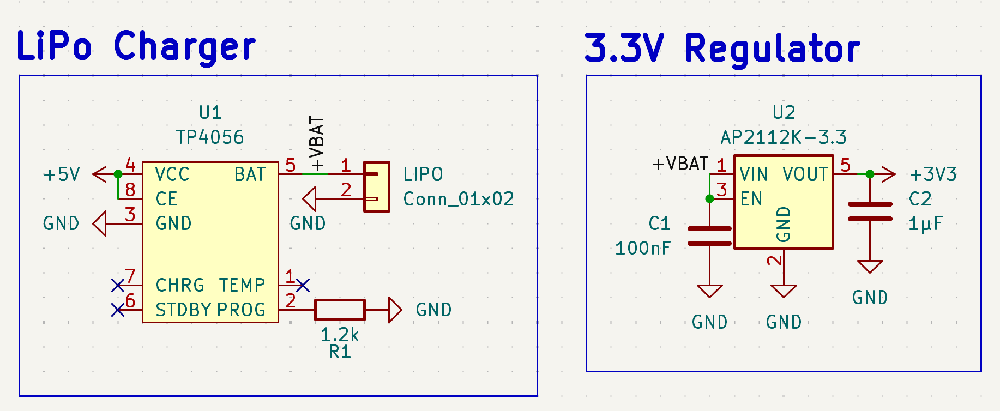
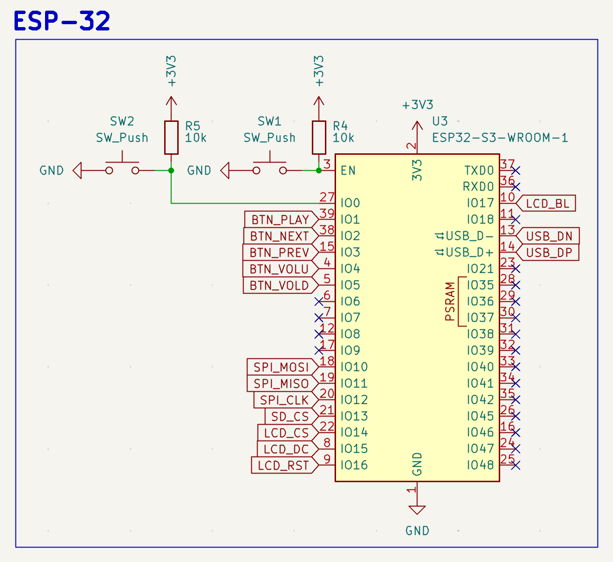

# 1 - (1hr) Starting with the Schematics
I've always loved music and it has been a big part of my life
So, i thought of making a bluetooth mp3 player

I started by researching and looking for repos so I can see what to make

## Schematics
I started by making the schematics, for now i've made the LiPo charger and 3.3V regulator

It was pretty easy ngl i didnt really face any problems with these except maybe figuring out decoupling caps again

I say again because i used them for my first keyboard and then i forgot how they worked

---

# 2 - (1.5hr) Making the ESP-32
I kinda had no idea how to proceed, I did know I'd need an ESP-32 because I wanted a screen module, so i did some research and made this

I didn't know how to put the buttons (sw_push) and that part took a bit of time but at the end i did manage to figure it out

Here's an image of the ESP-32 schematic

I'll do the audio DAC next!

---